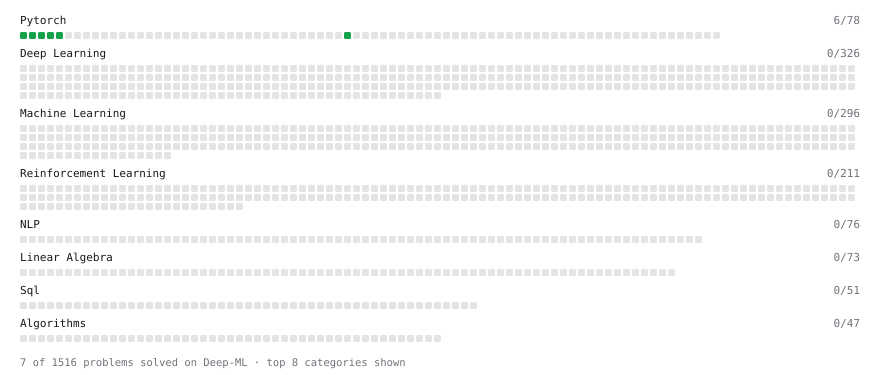

# Deep-ML

My machine learning practice from [Deep-ML](https://www.deep-ml.com). Every solution here was written by hand.

**2** solved · 1 problems · 1 labs · 0 math

[**Browse the interactive portfolio**](https://utsusemioxo.github.io/deep-ml/) to replay this filling in over time.

## Problems

| | Difficulty | Solved | |
| --- | --- | --- | --- |
| [Derivative of Softmax](https://www.deep-ml.com/problems/219) | medium | 2026-10-09 | [solution](problems/0219-derivative-of-softmax) |

## Labs

| | Difficulty | Solved | |
| --- | --- | --- | --- |
| [Design Your Own Activation Function](https://www.deep-ml.com/labs/9) | easy | 2026-10-10 | [solution](labs/0009-design-your-own-activation-function) |

---

_This file is regenerated by Deep-ML on every push._
